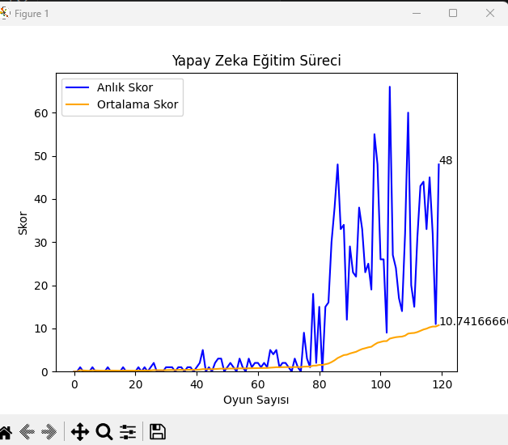

# 🐍 Snake AI - Deep Q-Learning (DQN)

This project implements a Reinforcement Learning agent that learns to play the classic Snake game from scratch using a **Deep Q-Network (DQN)**. The agent observes its environment, makes decisions, and improves its strategy over time through trial and error, aiming to maximize its score. 

As the agent plays, a live updating matplotlib graph visualizes its learning progress (scores and moving averages).



## 🧠 AI Architecture

The agent uses **Q-Learning** with a Deep Neural Network implemented in **PyTorch**. The model uses the Bellman Equation to update its Q-values: `Q_new = R + gamma * max(Q(S_next))`

### 1. State (11 Values)
The agent doesn't see the whole screen; it only senses its immediate surroundings to make computations highly efficient. The state is represented as an 11-element boolean array:
* **Danger detection:** Danger straight, danger right, danger left.
* **Current direction:** Moving left, right, up, down.
* **Food location:** Food is left, right, up, down.

### 2. Action (3 Values)
Instead of absolute directions (North, South, etc.), the agent predicts relative moves. This simplifies the learning process:
* `[1, 0, 0]` : Keep going straight
* `[0, 1, 0]` : Turn right
* `[0, 0, 1]` : Turn left

### 3. Reward System
* Eat food: **+10**
* Game Over (Hit wall or self): **-10**
* Else: **0**

## ⚙️ Tech Stack & Hardware
* **Python** (Core logic)
* **PyTorch** (Deep Learning & Neural Network)
* **Pygame** (Game Environment & UI)
* **NumPy** (Matrix operations)
* **Matplotlib & IPython** (Live training visualization)
* *Note: The model is configured to automatically detect and utilize CUDA for GPU acceleration if available, significantly speeding up the Experience Replay training phase.*

## 🚀 How to Run (Local Setup)

1. Clone the repository:
```bash
git clone [https://github.com/KULLANICI_ADIN/snake-ai-dqn.git](https://github.com/KULLANICI_ADIN/snake-ai-dqn.git)
cd snake-ai-dqn
Install the required dependencies:

Bash
pip install torch torchvision torchaudio pygame numpy matplotlib ipython
(Make sure to install the CUDA-supported version of PyTorch if you have an NVIDIA GPU).

Run the AI agent:

Bash
python agent.py
📁 Project Structure
game.py: The Pygame environment, including collision logic and UI rendering.

model.py: The PyTorch Neural Network architecture (Linear_QNet) and the Q-Trainer.

agent.py: The core RL agent managing states, actions, memory (Experience Replay), and the training loop.

helper.py: Live plotting module that visualizes the agent's learning progress in real-time.

model/: Directory where the trained model weights (model.pth) are saved automatically.